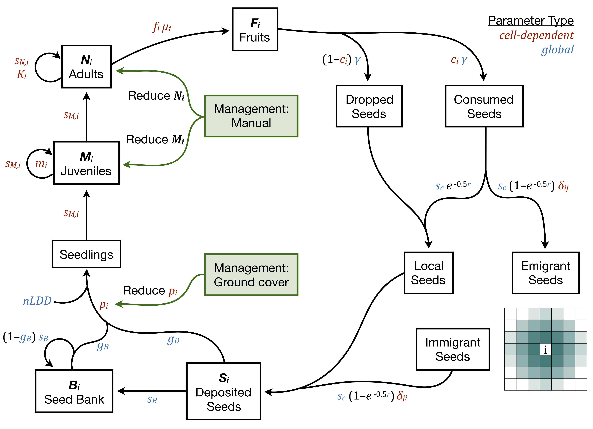

# gbPopMod  

This R package runs a population-level demographic cellular automata model. The life history structure and default parameterization are based on [glossy buckthorn](https://en.wikipedia.org/wiki/Frangula_alnus) (*Frangula alnus*) in New England. The model is spatially explicit and temporally dynamic, simulating the growth and spread of a species on a gridded landscape. Population and life history dynamics occur within each occupied grid cell, driven by vital rates and demographic parameters which can be global or dependent on the cell environment. Cells are connected through mechanistic short distance dispersal and rare long distance dispersal. Management actions can target specific life stages, such as reducing seedling establishment (e.g., through planted ground cover) or reducing the number of adults (e.g., through cutting and/or spraying).  In each year, the simulation occurs according to the following series of steps:  

Parameters that vary with among cells can be estimated through regressions with environmental covariates [(Merow et al 2017)](https://doi.org/10.1073/pnas.1609633114) as appropriate for the species and system. Density dependence can be implemented either as a hard cap on the abundance within each cell [(Merow et al 2011)](https://doi.org/10.1086/660295) or through parameters such as the establishment probability, survival probabilities, or fruiting probabilities [(Ellner & Rees 2006)](https://doi.org/10.1086/499438).

# Running the model  
The model is run using the function `run_sim()`, though some set up is necessary for initializing the landscape. The script `vignettes/management_controls.R` assigns parameter values, establishes management strategies, and builds the landscape before running a set number of stochastic simulations. The script `hpc/hpc_wrap.R` runs a global sensitivity analysis, where many parameters are varied simultaneously. 
